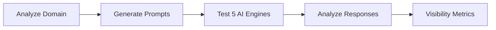

# AI Search Analytics

Monitor how AI engines like ChatGPT talk about your brand and discover optimization opportunities.

---

## Why Track AI Visibility?

**60% of searches now happen on AI assistants** instead of Google.

If AI doesn't recommend your brand, you're invisible to millions of potential customers.

<Info>
AI search is the new SEO. Optimize now before competitors dominate.
</Info>

---

## How It Works

**Time**: 5-10 minutes per analysis  
**Cost**: ~€5 (10 prompts × 5 engines)  
**Engines**: ChatGPT, Claude, Gemini, Perplexity, Mistral

---

## Quick Start

<Steps>
  <Step title="Create Project">
    Go to **Analytics** > **AI Search** > **New Project**
  </Step>
  <Step title="Analyze Domain">
    Enter your website, AI extracts business info
  </Step>
  <Step title="Generate Prompts">
    AI creates 10 test queries
  </Step>
  <Step title="Run Analysis">
    Test on 5 AI engines simultaneously
  </Step>
  <Step title="View Results">
    See visibility score, position, sentiment
  </Step>
</Steps>

---

## Key Concepts

### Visibility Score

**% of AI responses that mention your brand.**

**Example**: 10 prompts × 5 engines = 50 responses  
If your brand appears in 20 responses → **40% visibility**

**Benchmarks**:
- Brand prompts: 80-100% (you're asked directly)
- Product prompts: 60-80%
- Competitor prompts: 30-50%
- Intent prompts: 10-30% (excellent if > 20%!)

### Average Position

**Where you rank when mentioned** (#1-10 in lists)

**Example**: ChatGPT lists you #3, Claude #1, Gemini doesn't mention you  
Average position = (3 + 1) / 2 = **#2.0**

**Benchmarks**:
- Excellent: #1-2
- Good: #3-5
- Poor: > #5

### Sentiment

**How positively AI talks about you.**

- **Positive**: "Best", "Recommended", "Excellent"
- **Neutral**: Factual description
- **Negative**: "However", "Limited", "Issues with"

**Target**: > 80% positive sentiment

---

## The 5 AI Engines

<CardGroup cols={2}>
  <Card title="ChatGPT (GPT-5)" icon="robot">
    **Users**: 200M+  
    **Best for**: General queries  
    **Visibility**: Highest for popular brands
  </Card>
  <Card title="Claude (3.5 Sonnet)" icon="robot">
    **Users**: 50M+  
    **Best for**: Detailed analysis  
    **Visibility**: Favors quality content
  </Card>
  <Card title="Gemini (2.5 Flash)" icon="robot">
    **Users**: 100M+ (Google users)  
    **Best for**: Factual queries  
    **Visibility**: Tied to Google data
  </Card>
  <Card title="Perplexity (Sonar Pro)" icon="robot">
    **Users**: 10M+  
    **Best for**: Research queries  
    **Visibility**: Citations matter
  </Card>
  <Card title="Mistral (Large)" icon="robot">
    **Users**: 5M+ (Europe focus)  
    **Best for**: European queries  
    **Visibility**: Emerging market
  </Card>
</CardGroup>

---

## Prompt Categories

### Brand Prompts (1 prompt)

**Direct questions about your company.**

**Example**: "What is Acme Inc?"  
**Expected visibility**: 90-100%  
**Goal**: Ensure AI has accurate info about you

### Product Prompts (1 prompt)

**Questions about your offerings.**

**Example**: "What services does Acme offer?"  
**Expected visibility**: 80-100%  
**Goal**: Ensure AI knows your product lineup

### Competitor Prompts (3 prompts)

**"Best in category" lists and comparisons.**

**Examples**:
- "Best CRM for startups"
- "Top alternatives to Salesforce"
- "Acme vs Competitor X"

**Expected visibility**: 30-60%  
**Goal**: Appear in recommendation lists

### Intent Prompts (5 prompts) ⭐ MOST VALUABLE

**Discovery queries where user doesn't know you yet.**

**Examples**:
- "What's the best tool for [your use case]?"
- "I need [your service], what do you recommend?"
- "How do I solve [problem you solve]?"

**Expected visibility**: 10-30%  
**Goal**: Get recommended organically (highest ROI!)

<Warning>
Intent prompts are THE MOST IMPORTANT. They test if AI recommends you when users don't know you exist yet.
</Warning>

---

## Complete Workflow

<CardGroup cols={4}>
  <Card title="1. Create Project" icon="folder-plus" href="/ai-search/creating-projects">
    Set up brand monitoring
  </Card>
  <Card title="2. Analyze Domain" icon="magnifying-glass" href="/ai-search/domain-analysis">
    Extract business info
  </Card>
  <Card title="3. Generate Prompts" icon="message" href="/ai-search/prompt-generation">
    Create test queries
  </Card>
  <Card title="4. Run Analysis" icon="play" href="/ai-search/running-analysis">
    Test on 5 engines
  </Card>
</CardGroup>

<CardGroup cols={4}>
  <Card title="5. View Metrics" icon="chart-bar" href="/ai-search/understanding-metrics">
    Visibility, position, sentiment
  </Card>
  <Card title="6. Check Competitors" icon="users" href="/ai-search/competitors">
    See who ranks higher
  </Card>
  <Card title="7. Optimize" icon="sparkles" href="/ai-search/optimization-tips">
    Improve content
  </Card>
  <Card title="8. Track Progress" icon="chart-line" href="/ai-search/optimization-tips">
    Re-analyze monthly
  </Card>
</CardGroup>

---

## Use Cases

<Tabs>
  <Tab title="SEO Agencies">
    Monitor clients' AI visibility and offer "AI SEO" as new service (€500/month per client).
  </Tab>
  <Tab title="Startups">
    Track if AI recommends you vs competitors. Optimize content to improve ranking.
  </Tab>
  <Tab title="Local Businesses">
    Ensure ChatGPT mentions you when users ask "best [your service] in [city]".
  </Tab>
  <Tab title="PR Agencies">
    Measure PR campaign impact on AI visibility. Show clients concrete ROI.
  </Tab>
</Tabs>

---

## Next Steps

<Steps>
  <Step title="Create Your First Project" href="/ai-search/creating-projects">
    Set up brand monitoring for your website
  </Step>
  <Step title="Learn the Metrics" href="/ai-search/understanding-metrics">
    Understand visibility, position, and sentiment
  </Step>
  <Step title="Optimize Your Content" href="/ai-search/optimization-tips">
    Improve your AI rankings
  </Step>
</Steps>

---

<Check>
**Ready to dominate AI search?** Start with [Creating a Project →](/ai-search/creating-projects)
</Check>
