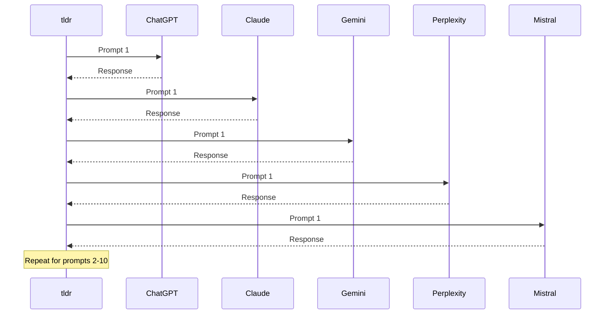

# Running AI Analysis

Send your prompts to 5 AI engines and analyze their responses.

---

## Quick Start

### Step 1: Click "Run Analysis"

In your project, click **"Run Analysis"**

### Step 2: Select Engines

<ParamField path="engines" type="array" default={["all"]}>
  **AI Engines to Test**
</ParamField>

**Default**: All 5 engines selected

You can uncheck engines to save credits:
- ✅ ChatGPT (GPT-5)
- ✅ Claude (3.5 Sonnet)
- ✅ Gemini (2.5 Flash)
- ✅ Perplexity (Sonar Pro)
- ✅ Mistral (Large)

<Tip>
Test all engines first. In future analyses, focus on engines where you perform worst.
</Tip>

### Step 3: Confirm & Start

Review cost estimate:
```
10 active prompts × 5 engines = 50 queries
Estimated cost: ~€5.00
```

Click **"Start Analysis"**

### Step 4: Watch Progress

Real-time progress bar shows:
- Current prompt being tested
- Responses received
- Estimated time remaining

**Time**: 5-10 minutes for full analysis

<Frame>
  
</Frame>

---

## What Happens During Analysis



For each prompt:
1. Sent to all 5 engines simultaneously
2. Each engine generates response
3. GPT-5 analyzes each response:
   - Is your brand mentioned?
   - Where does it rank?
   - What's the sentiment?
   - Which competitors mentioned?

---

## Analysis Results

Once complete, you'll see:

<Frame>
  
</Frame>

### Overview Metrics

<CardGroup cols={4}>
  <Card title="Visibility Score" icon="eye">
    40%
    
    Your brand mentioned in 20/50 responses
  </Card>
  <Card title="Avg Position" icon="ranking-star">
    #2.0
    
    Average ranking when mentioned
  </Card>
  <Card title="Sentiment" icon="smile">
    66% Positive
    
    Sentiment breakdown
  </Card>
  <Card title="Mentions" icon="hashtag">
    20 / 50
    
    Total brand mentions
  </Card>
</CardGroup>

### Breakdown by Category

| Category | Visibility | Avg Position | Mentions |
|----------|-----------|--------------|----------|
| Brand | 100% | #1.0 | 5/5 |
| Product | 80% | #1.5 | 4/5 |
| Competitor | 40% | #3.0 | 6/15 |
| Intent | 20% | #2.5 | 5/25 |

### Breakdown by Engine

| Engine | Visibility | Avg Position | Mentions |
|--------|-----------|--------------|----------|
| ChatGPT | 50% | #2.0 | 5/10 |
| Claude | 30% | #3.0 | 3/10 |
| Gemini | 60% | #1.5 | 6/10 |
| Perplexity | 40% | #2.0 | 4/10 |
| Mistral | 20% | #4.0 | 2/10 |

<Tip>
Focus optimization efforts on engines where you have LOW visibility!
</Tip>

---

## Detailed Results

### Per-Prompt Analysis

Click on any prompt to see individual responses:

<Frame>
  
</Frame>

**For each engine**:
- ✅ **Mentioned**: Brand appeared
- ❌ **Not mentioned**: Brand ignored
- **Position**: #1-10 if mentioned
- **Sentiment**: Positive/Neutral/Negative
- **Full response**: Complete AI answer

### Response Text

Read what AI actually said about you:

```
ChatGPT Response:
"For sales automation, I'd recommend:
1. Salesforce - Enterprise-grade CRM
2. Acme Inc - Affordable option for startups
3. HubSpot - All-in-one marketing + sales"
```

**Analysis**:
- ✅ Mentioned: Yes
- **Position**: #2
- **Sentiment**: Positive ("affordable option")
- **Competitors**: Salesforce (#1), HubSpot (#3)

---

## Re-Running Analysis

### When to Re-Run

- **Monthly**: Track progress over time
- **After content updates**: See if optimization worked
- **After PR campaigns**: Measure impact
- **New competitors**: Include in prompts

### How to Re-Run

1. Go to project
2. Click **"Run Analysis"** again
3. Choose same or different engines
4. View history in **"Analyses"** tab

<Info>
Each analysis is saved. Compare results over time to see improvement!
</Info>

---

## Cost & Credits

### Pricing per Query

| Engine | Cost per Query |
|--------|---------------|
| ChatGPT (GPT-5) | €0.05-0.10 |
| Claude (3.5 Sonnet) | €0.10-0.15 |
| Gemini (2.5 Flash) | €0.01-0.02 |
| Perplexity (Sonar Pro) | €0.10-0.15 |
| Mistral (Large) | €0.05-0.08 |

**Full analysis** (10 prompts × 5 engines):
- **Total**: 50 queries
- **Cost**: ~€5.00

<Tip>
Use your own OpenRouter key for ~30% lower costs!
</Tip>

---

## Troubleshooting

<AccordionGroup>
  <Accordion title="Analysis taking too long">
    **Normal**: 5-10 minutes for 50 queries
    
    **If > 15 minutes**:
    - Check progress bar (might be stuck)
    - Refresh page
    - Contact support if stuck
  </Accordion>

  <Accordion title="Some engines failed">
    **Possible reasons**:
    - Engine temporarily down
    - Rate limit hit
    - Insufficient OpenRouter credits
    
    **Solution**: Re-run analysis for failed engines only
  </Accordion>

  <Accordion title="All visibility scores are 0%">
    **Possible reasons**:
    - New/unknown brand
    - No online presence
    - Wrong domain analyzed
    
    **Solution**: Verify domain, add more content, try again in 1 month
  </Accordion>
</AccordionGroup>

---

## Next Steps

<CardGroup cols={2}>
  <Card title="Understand Metrics" icon="chart-bar" href="/ai-search/understanding-metrics">
    Learn what visibility, position, sentiment mean
  </Card>
  <Card title="Check Competitors" icon="users" href="/ai-search/competitors">
    See who AI recommends instead
  </Card>
  <Card title="Optimize Content" icon="sparkles" href="/ai-search/optimization-tips">
    Improve your AI visibility
  </Card>
</CardGroup>

---

<Check>
**Analysis complete!** Next: [Understand your metrics →](/ai-search/understanding-metrics)
</Check>
