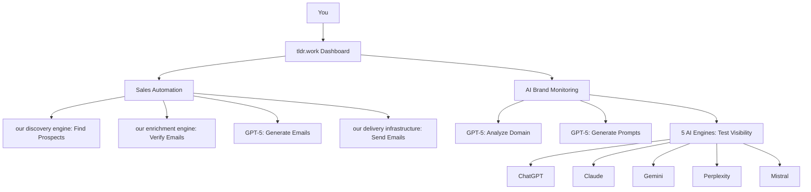

# How tldr.work Works

tldr.work combines cutting-edge AI technology with powerful APIs to automate sales and monitor brand visibility. Here's how everything works under the hood.

## Architecture Overview



---

## Sales Automation Workflow

### 1. Prospect Discovery (our discovery engine)

**What happens when you search for prospects:**

<Steps>
  <Step title="You enter search criteria">
    Example: "French bakeries in Paris"
  </Step>
  <Step title="tldr.work queries our discovery engine API">
    our discovery engine is a powerful web scraping tool that crawls the web intelligently.
  </Step>
  <Step title="our discovery engine finds matching companies">
    Returns company name, website, industry, location, and description.
  </Step>
  <Step title="Results appear in your dashboard">
    Typically takes 20-40 seconds for 10-50 results.
  </Step>
</Steps>

<Info>
**Why our discovery engine?** It's specifically designed for business data extraction and returns structured, clean data.
</Info>

### 2. Email Enrichment (our enrichment engine)

**What happens when you enrich prospect data:**

<Steps>
  <Step title="tldr.work sends company domain to our enrichment engine">
    Example: `bakery-paris.fr`
  </Step>
  <Step title="our enrichment engine finds all email addresses">
    Searches public sources: company website, LinkedIn, directories.
  </Step>
  <Step title="our enrichment engine verifies each email">
    Checks if email exists and is deliverable (MX records, SMTP validation).
  </Step>
  <Step title="You get verified contacts">
    Name, role, email, LinkedIn profile, and verification score (0-100).
  </Step>
</Steps>

<Tip>
Emails with verification score > 90 have 98%+ deliverability rate.
</Tip>

### 3. Email Generation (GPT-5)

**What happens when you generate an email:**

<Steps>
  <Step title="You provide context">
    Campaign goal, tone (professional/casual), length (short/medium/long).
  </Step>
  <Step title="tldr.work prepares the prompt">
    Includes prospect info (company, industry, recipient name/role).
  </Step>
  <Step title="GPT-5 generates personalized email">
    Creates subject line + body tailored to the prospect.
  </Step>
  <Step title="You review and edit">
    You can regenerate or manually tweak before sending.
  </Step>
</Steps>

**Example Prompt to GPT-5:**
```
You are an expert sales copywriter. Write a professional cold email.

Context:
- Recipient: Marie Dupont, Owner at La Pâtisserie Parisienne
- Industry: French bakery
- Location: Paris, France
- Goal: Offer marketing services for local bakeries
- Tone: Professional but warm
- Length: Short (150 words)

Generate:
1. Subject line (under 50 characters)
2. Email body (personalized, value-focused)
```

<Warning>
GPT-5 uses the prospect's info to personalize each email. Never use generic templates!
</Warning>

### 4. Campaign Execution (our delivery infrastructure)

**What happens when you launch a campaign:**

<Steps>
  <Step title="tldr.work queues emails">
    Adds all recipients to a background job queue (Redis + BullMQ).
  </Step>
  <Step title="Respects daily limits">
    Default: 50 emails/day (prevents spam flags). Customizable per campaign.
  </Step>
  <Step title="Sends via our delivery infrastructure API">
    our delivery infrastructure handles SMTP, SPF, DKIM, bounce handling.
  </Step>
  <Step title="Tracks engagement">
    Opens, clicks, and replies are logged automatically.
  </Step>
</Steps>

<Info>
**Why daily limits?** Sending 1000 emails at once triggers spam filters. Gradual sending (50/day) maintains sender reputation.
</Info>

---

## AI Brand Monitoring Workflow

### 1. Domain Analysis (GPT-5-mini)

**What happens when you analyze a domain:**

<Steps>
  <Step title="tldr.work scrapes your website">
    Uses our discovery engine to extract main content (text, metadata, structure).
  </Step>
  <Step title="Sends content to GPT-5-mini">
    Asks AI to extract business information.
  </Step>
  <Step title="GPT-5-mini analyzes and structures data">
    Returns: company name, industry, description, services, keywords, competitors.
  </Step>
  <Step title="Results saved to your project">
    Used for prompt generation in the next step.
  </Step>
</Steps>

**Example Analysis Output:**
```json
{
  "companyName": "La Pâtisserie Parisienne",
  "sector": "Food & Beverage (Bakery)",
  "description": "Traditional French bakery offering artisan bread, pastries, and cakes",
  "location": "Paris, France",
  "services": ["Bread baking", "Custom cakes", "Catering"],
  "keywords": ["French bakery", "artisan bread", "Paris pastries"],
  "suggestedCompetitors": ["Poilâne", "Du Pain et des Idées", "Liberté"]
}
```

<Tip>
**Why GPT-5-mini?** It's 10x faster and cheaper than GPT-5 for simple extraction tasks, with nearly the same accuracy.
</Tip>

### 2. Prompt Generation (GPT-5-mini)

**What happens when you generate prompts:**

<Steps>
  <Step title="tldr.work sends domain analysis to GPT-5-mini">
    Includes company info, industry, services, competitors.
  </Step>
  <Step title="Asks AI to create 10 realistic prompts">
    Divided into categories: Brand, Product, Competitor, Intent.
  </Step>
  <Step title="GPT-5-mini generates prompts">
    Mimics real user queries (e.g., "Best bakery in Paris for birthday cakes").
  </Step>
  <Step title="Prompts validated automatically">
    "Intent" prompts must NOT contain brand name (tests organic discovery).
  </Step>
</Steps>

**Prompt Categories Explained:**

| Category | Description | Example | Contains Brand? |
|----------|-------------|---------|-----------------|
| **Brand** | Direct questions about your company | "What is La Pâtisserie Parisienne?" | ✅ Yes |
| **Product** | Questions about your offerings | "What does La Pâtisserie Parisienne sell?" | ✅ Yes |
| **Competitor** | Comparisons or "best in category" | "Best bakeries in Paris" | ❌ No |
| **Intent** | Discovery queries (HIGH VALUE) | "Where to buy artisan bread in Paris?" | ❌ No |

<Warning>
**Intent prompts** are the most important! They test if AI recommends you when users don't know you exist yet.
</Warning>

### 3. Multi-Engine Testing (our AI gateway)

**What happens when you run an analysis:**

<Steps>
  <Step title="tldr.work selects active prompts">
    You can enable/disable any of the 10 generated prompts.
  </Step>
  <Step title="Sends each prompt to 5 AI engines">
    Via our AI gateway API (unified gateway for all LLMs).
  </Step>
  <Step title="Each engine generates a response">
    - ChatGPT (GPT-5)
    - Claude (3.5 Sonnet)
    - Gemini (2.5 Flash)
    - Perplexity (Sonar Pro)
    - Mistral (Large)
  </Step>
  <Step title="tldr.work analyzes each response">
    Checks: Is your brand mentioned? Where does it rank? What's the sentiment?
  </Step>
</Steps>

**Example Prompt Flow:**
```
Prompt: "Best bakery in Paris for wedding cakes"

→ Sent to 5 engines in parallel
→ ChatGPT response: "Top 3 bakeries: 1. Ladurée 2. Pierre Hermé 3. La Pâtisserie Parisienne"
→ Claude response: "I'd recommend Stohrer, the oldest bakery in Paris..."
→ Gemini response: "For wedding cakes, consider La Pâtisserie Parisienne or Angelina"
→ Perplexity response: [lists 8 bakeries, yours is #6]
→ Mistral response: [doesn't mention your brand]

→ tldr.work calculates:
   - Visibility: 60% (mentioned in 3/5 engines)
   - Avg Position: #3.3 (avg of ranks: 3, not mentioned, 1, 6, not mentioned)
   - Sentiment: Positive
```

<Info>
**Why our AI gateway?** It provides access to all major AI models via one API, with consistent formatting and billing.
</Info>

### 4. Response Analysis (GPT-5)

**What happens when analyzing AI responses:**

<Steps>
  <Step title="tldr.work sends response to GPT-5">
    Asks: "Is [Your Brand] mentioned? Where? What's the sentiment?"
  </Step>
  <Step title="GPT-5 extracts structured data">
    Returns: isMentioned (yes/no), position (#1-10), sentiment (positive/neutral/negative), competitors mentioned.
  </Step>
  <Step title="Aggregates across all prompts">
    Calculates average visibility, position, and sentiment.
  </Step>
  <Step title="Results displayed in dashboard">
    Visual charts + detailed breakdown per prompt/engine.
  </Step>
</Steps>

<Tip>
**Why GPT-5 for analysis?** It's the best at understanding context and extracting nuanced information from text.
</Tip>

---

## Technology Stack

### Frontend
- **Next.js 15**: React framework for fast, SEO-friendly pages
- **Tailwind CSS**: Modern, responsive UI design
- **TanStack Query**: Real-time data fetching and caching

### Backend
- **Fastify**: High-performance Node.js server
- **MongoDB**: NoSQL database for flexible data storage
- **Redis + BullMQ**: Background job processing (emails, AI analysis)

### AI & APIs
- **our AI gateway**: Unified gateway to all AI models (GPT, Claude, Gemini, etc.)
- **our discovery engine**: Web scraping and company data extraction
- **our enrichment engine**: Email finding and verification
- **our delivery infrastructure**: Transactional email delivery

### Security & Billing
- **JWT**: Secure authentication tokens
- **Stripe**: Payment processing and subscription management
- **Encrypted storage**: Sensitive credentials encrypted at rest

---

## Performance & Reliability

### Speed
- **Prospect search**: 20-40 seconds for 10-50 results
- **Email enrichment**: 2-5 seconds per prospect
- **Email generation**: 3-5 seconds per email
- **AI analysis**: 5-10 minutes for 10 prompts × 5 engines (50 queries)

### Accuracy
- **Prospect data**: 95%+ accuracy (our discovery engine filters out invalid data)
- **Email verification**: 98%+ deliverability (our enrichment engine's verification algorithm)
- **AI generation**: GPT-5 produces human-quality text in 99% of cases

### Reliability
- **Uptime**: 99.9% (hosted on Railway with auto-scaling)
- **Failover**: If one AI engine fails, others continue
- **Queue system**: Jobs retry automatically on failure

---

## Next Steps

<CardGroup cols={2}>
  <Card title="Try Sales Automation" icon="rocket" href="/sales-automation/overview">
    Learn how to find prospects and launch campaigns
  </Card>
  <Card title="Try AI Monitoring" icon="chart-line" href="/ai-search/overview">
    Track your brand across AI engines
  </Card>
  <Card title="View Key Features" icon="stars" href="/introduction/key-features">
    Explore all capabilities in detail
  </Card>
  <Card title="Get Started" icon="play" href="/quickstart">
    Set up your account in 5 minutes
  </Card>
</CardGroup>

---

<Note>
**Questions?** Email support@tldr.work
</Note>
