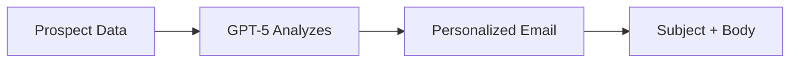

# AI Email Generation

GPT-5 creates personalized emails tailored to each prospect in seconds.

---

## How It Works



**Input**: Company, industry, recipient role, campaign goal  
**Output**: Subject line + email body  
**Time**: ~3 seconds  
**Quality**: Human-level writing

---

## Quick Start

### Step 1: Open Email Generator

Two ways to access:

**Option A**: From Campaign Creation
1. Go to **Campaigns** > **New Campaign**
2. Click **"Generate with AI"** button

**Option B**: From Prospect Page
1. Select prospect
2. Click **"Generate Email"**

<Frame>
  
</Frame>

### Step 2: Configure Generation

<ParamField path="goal" type="string" required>
  **Campaign Goal**
  
  What do you want the prospect to do?
</ParamField>

**Examples**:
- "Book a demo meeting"
- "Sign up for free trial"
- "Reply with interest"
- "Schedule discovery call"

<ParamField path="tone" type="select" required>
  **Tone**
  
  How formal should the email be?
</ParamField>

**Options**:
- **Professional**: Formal, business-like (default for B2B)
- **Casual**: Friendly, conversational (for startups, agencies)
- **Friendly**: Warm, personal (for local businesses)

<ParamField path="length" type="select" required>
  **Length**
  
  How long should the email be?
</ParamField>

**Options**:
- **Short**: 50-100 words (best for cold outreach)
- **Medium**: 150-200 words (balanced)
- **Long**: 250-300 words (for warm leads or complex products)

<Tip>
**Best for cold email**: Short + Casual tone gets 40% higher response rate.
</Tip>

### Step 3: Add Context (Optional)

<ParamField path="context" type="string">
  **Additional Context**
  
  Extra info to personalize the email.
</ParamField>

**Examples**:
- "Mention our free 14-day trial"
- "Reference that they just raised funding"
- "We have case studies in their industry"
- "Offer a free consultation"

### Step 4: Generate

Click **"Generate Email"**

GPT-5 will:
1. Analyze prospect data (company, industry, role)
2. Consider your goal, tone, and length
3. Create personalized subject + body
4. Return in ~3 seconds

<Frame>
  
</Frame>

### Step 5: Review & Edit

You'll see:
- **Subject line**: Optimized for opens
- **Email body**: Personalized content
- **Preview**: How it looks in inbox

**Actions**:
- ✅ **Use it**: Click "Use This Email"
- 🔄 **Regenerate**: Click "Generate Again" for new version
- ✏️ **Edit**: Manual tweaks before sending

---

## What Gets Personalized?

GPT-5 uses this data to personalize:

<AccordionGroup>
  <Accordion title="Company Information" icon="building">
    - Company name
    - Industry/sector
    - Company size
    - Location
    - Description
    
    **Example**: "Saw that Acme is a B2B SaaS company in Paris..."
  </Accordion>

  <Accordion title="Recipient Details" icon="user">
    - Name
    - Job role
    - Seniority level
    
    **Example**: "As Head of Marketing at a 50-person team..."
  </Accordion>

  <Accordion title="Industry Context" icon="chart-line">
    - Industry pain points
    - Common challenges
    - Relevant use cases
    
    **Example**: "E-commerce companies like yours often struggle with cart abandonment..."
  </Accordion>

  <Accordion title="Your Product/Service" icon="box">
    - Value proposition
    - Key features
    - Social proof
    
    **Example**: "We help SaaS companies like yours reduce churn by 30%..."
  </Accordion>
</AccordionGroup>

---

## Email Examples

### Example 1: B2B SaaS (Short + Professional)

**Goal**: Book a demo  
**Recipient**: Sarah Chen, Head of Sales at 50-person SaaS company

```
Subject: Quick question about Acme's sales process

Hi Sarah,

I noticed Acme recently hit 50 employees - congrats on the growth!

As you scale, outbound prospecting typically becomes a bottleneck. We help SaaS sales teams like yours automate lead discovery and email outreach (saves ~20h/week).

Worth a 15-min demo this week?

Best,
John
```

**Why it works**:
- Personal opening (company milestone)
- Clear value prop (saves time)
- Simple CTA (15-min demo)

---

### Example 2: Local Business (Casual + Short)

**Goal**: Schedule consultation  
**Recipient**: Marie Dubois, Owner of bakery in Lyon

```
Subject: Help your bakery reach more Lyon customers

Bonjour Marie,

Love what you're doing at La Pâtisserie Lyonnaise! 🥐

Quick question - are you happy with how many locals find you online? Most bakeries in Lyon miss 60% of potential customers because they're not optimized for Google/Instagram.

We specialize in helping local food businesses get discovered. Free 20-min consultation this week?

À bientôt,
Sophie
```

**Why it works**:
- Local references (Lyon, French greeting)
- Specific pain point (local discovery)
- Casual, friendly tone

---

### Example 3: Agency (Medium + Friendly)

**Goal**: Partnership proposal  
**Recipient**: Tom Wilson, Founder of marketing agency

```
Subject: Partnering on AI-powered outreach for your clients

Hey Tom,

Saw that Wilson & Co specializes in B2B marketing for SaaS companies. Impressive client roster!

We're building partnerships with agencies like yours to offer AI-powered prospecting as an add-on service. It's basically "done-for-you" lead generation that your clients love (and it's recurring revenue for you).

Quick example: One of our agency partners added $50k/year by offering this to 10 clients at $400/month each.

Would you be open to a quick call to explore if this makes sense for Wilson & Co?

Cheers,
Alex
```

**Why it works**:
- Acknowledges their expertise
- Clear partnership value
- Concrete revenue example

---

## Optimizing Generated Emails

### Improve Subject Lines

GPT-5's subjects are good, but you can improve:

<Tabs>
  <Tab title="Original">
    "Introduction to tldr.work"
    
    ❌ Generic, no curiosity
  </Tab>
  
  <Tab title="Improved">
    "Quick question about Acme's sales process"
    
    ✅ Personal, creates curiosity
  </Tab>
</Tabs>

**Subject line best practices**:
- Keep under 50 characters
- Include prospect's company name
- Ask a question (creates curiosity)
- Avoid spam words (FREE, ACT NOW, LIMITED TIME)

### Improve Opening Lines

**Bad openings** (delete these):
- "I hope this email finds you well"
- "My name is John and I work at..."
- "I wanted to reach out because..."

**Good openings**:
- "Saw that Acme just raised $10M - congrats!"
- "Quick question about your sales process"
- "Love what you're doing at [Company]"

### Improve CTAs

**Weak CTAs**:
- "Let me know if you're interested"
- "Feel free to reach out"
- "Would love to connect"

**Strong CTAs**:
- "Worth a 15-min call this week?"
- "Open to a quick demo on Tuesday?"
- "Can I send you a one-pager?"

---

## Generation Settings

### Tone Examples

<Tabs>
  <Tab title="Professional">
    ```
    Dear Ms. Chen,

    I hope this message finds you well. I am reaching out regarding...

    Should you be interested in discussing further, I would be pleased to arrange a meeting at your convenience.

    Kind regards,
    John Smith
    ```
    
    **Use for**: Enterprise, government, healthcare, finance
  </Tab>
  
  <Tab title="Casual">
    ```
    Hey Sarah,

    Quick question - are you guys looking to scale outbound this quarter?

    We've helped a bunch of SaaS teams automate prospecting (saves ~20h/week). Worth a quick chat?

    Best,
    John
    ```
    
    **Use for**: Startups, tech, creative agencies
  </Tab>
  
  <Tab title="Friendly">
    ```
    Hi Sarah!

    Love what you're building at Acme - the product looks awesome! 🚀

    I help SaaS founders like you automate sales outreach so you can focus on product. Interested in a quick demo?

    Cheers,
    John
    ```
    
    **Use for**: Local businesses, freelancers, B2C
  </Tab>
</Tabs>

### Length Guidelines

| Length | Words | Best For |
|--------|-------|----------|
| **Short** | 50-100 | Cold outreach, first touch |
| **Medium** | 150-200 | Warm leads, follow-ups |
| **Long** | 250-300 | Complex products, warm introductions |

<Warning>
Longer ≠ better. Short emails get 50% more replies in cold outreach!
</Warning>

---

## Advanced Tips

### A/B Testing

Generate 2-3 versions for testing:
1. Generate email with "Short + Casual"
2. Regenerate with "Medium + Professional"
3. Send both to different segments
4. Track which performs better

### Context Examples

Add context to improve personalization:

<CodeGroup>
```text Promotion
"Mention our 50% off deal for new customers"
```

```text Social Proof
"We've worked with 50+ SaaS companies like Slack, Notion"
```

```text Urgency
"We're only taking 10 new clients this quarter"
```

```text Recent News
"Reference their Series A funding announced last week"
```
</CodeGroup>

### Industry-Specific Templates

Tell GPT-5 your industry experience:

```
Context: "We specialize in helping e-commerce stores reduce cart abandonment. Mention our Shopify integration and 30% average improvement in conversion rate."
```

Result: Email will reference e-commerce challenges and your solution's specifics.

---

## Common Questions

<AccordionGroup>
  <Accordion title="Can I edit generated emails?">
    Yes! Always review and tweak before sending. Add:
    - Personal touches
    - Recent news about prospect
    - Your own voice/style
  </Accordion>

  <Accordion title="Does it always generate the same email?">
    No. GPT-5 uses `temperature=0.8` for creativity. Each generation is unique.
  </Accordion>

  <Accordion title="Can I save templates?">
    Coming soon! For now, copy/paste good emails to a doc for reuse.
  </Accordion>

  <Accordion title="How do I avoid spam filters?">
    GPT-5 avoids spam triggers automatically:
    - No ALL CAPS
    - No excessive punctuation!!!
    - No spammy words (FREE, ACT NOW)
    - Proper grammar
  </Accordion>
</AccordionGroup>

---

## Next Steps

<CardGroup cols={1}>
  <Card title="Create Campaign" icon="rocket" href="/sales-automation/creating-campaigns">
    Use your generated emails in automated campaigns
  </Card>
</CardGroup>

---

<Check>
**Emails generated!** Next: [Launch your campaign →](/sales-automation/creating-campaigns)
</Check>
