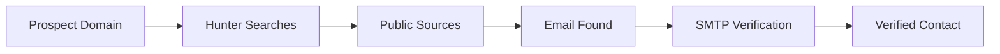

# Email Enrichment

Turn company names into qualified contacts with verified email addresses.

---

## What is Enrichment?

**Enrichment** finds contact information for people at each company:
- Full name
- Job role/title
- Email address
- LinkedIn profile
- Verification score (0-100)

**Powered by**: Hunter.io (industry leader with 98%+ deliverability)

---

## How It Works



**Time**: 2-5 seconds per prospect  
**Cost**: ~€0.02 per enrichment  
**Deliverability**: 98%+ for verified emails

---

## Quick Start

### Step 1: Select Prospects

In **Prospects** page:
- Click **"Enrich All"** (enriches all prospects)
- Or select specific prospects → **"Enrich Selected"**

<Frame>
  
</Frame>

### Step 2: Wait for Results

Progress indicator shows enrichment status. Takes 2-5 seconds per prospect.

### Step 3: Review Contacts

Click on a prospect to see found contacts:

<Frame>
  
</Frame>

**Each contact shows**:
- ✅ Name: Full name
- 💼 Role: Job title
- 📧 Email: Verified email address
- 🔗 LinkedIn: Profile link
- ✔️ Score: Verification score (0-100)

---

## Understanding Verification Scores

| Score | Meaning | Deliverability | Action |
|-------|---------|----------------|--------|
| **90-100** | Verified + valid | 98%+ | ✅ Safe to send |
| **70-89** | Likely valid | 90-95% | ⚠️ Use with caution |
| **50-69** | Risky | 70-85% | ⚠️ High bounce risk |
| **0-49** | Invalid/catch-all | < 50% | ❌ Don't send |

<Tip>
Only email contacts with score > 90 for best campaign performance.
</Tip>

---

## What Gets Enriched?

### Name & Role

**What Hunter finds**:
- First and last name
- Job title (CEO, CTO, Head of Marketing, etc.)
- Seniority level (C-level, director, manager)

**Example**:
```
Name: Marie Dubois
Role: Head of Marketing
```

### Email Address

**How it's found**:
1. Company website (team page, about page)
2. LinkedIn profiles
3. Public directories
4. Hunter's database (200M+ emails)

**Email pattern detection**:
```
john.doe@acme.com → Pattern: first.last@domain
jane@acme.com → Pattern: first@domain
jsmith@acme.com → Pattern: firstletterslast@domain
```

### Verification Process

Hunter checks:
1. **MX records**: Domain configured for email
2. **SMTP validation**: Email mailbox exists
3. **Catch-all detection**: Does domain accept all emails?
4. **Disposable check**: Temp email services filtered

<Info>
Verification happens automatically - you don't need to do anything!
</Info>

---

## Targeting Decision-Makers

### Who to Target?

<Tabs>
  <Tab title="B2B SaaS">
    **Recommended roles**:
    - CEO (for startups < 20 people)
    - Head of Sales / Sales Director
    - Head of Marketing / CMO
    - Operations Manager
  </Tab>
  
  <Tab title="Agencies">
    **Recommended roles**:
    - Founder / Owner
    - Managing Director
    - Business Development Manager
  </Tab>
  
  <Tab title="E-commerce">
    **Recommended roles**:
    - E-commerce Manager
    - Head of Digital
    - Marketing Director
  </Tab>
  
  <Tab title="Local Businesses">
    **Recommended roles**:
    - Owner
    - Manager
    - Director
  </Tab>
</Tabs>

### Filtering by Role

After enrichment, filter contacts:
1. Go to **Prospects** > Select prospect
2. View **Contacts** tab
3. Filter by role: "CEO", "Founder", "Marketing"

<Tip>
Target seniority matching deal size:
- Small deals (< €5k): Managers
- Medium deals (€5-50k): Directors
- Large deals (> €50k): C-level
</Tip>

---

## Multiple Contacts Per Company

### Why Multiple Contacts?

One prospect can have 5-10 contacts:
- Different departments (sales, marketing, tech)
- Different seniority levels
- Increases chances of response

### Choosing the Best Contact

**Priority order**:
1. **Verification score**: Pick highest (>90)
2. **Seniority**: Match to your deal size
3. **Department**: Match to your offering
4. **Recent activity**: LinkedIn shows "Joined in 2025" = likely active

<Warning>
Don't email everyone at once! Pick 1-2 most relevant contacts per company.
</Warning>

---

## Enrichment Status

### Status Icons

| Icon | Status | Meaning |
|------|--------|---------|
| ✅ | Enriched | Contacts found |
| ⏳ | In Progress | Currently searching |
| ⚠️ | Partial | Some contacts found |
| ❌ | Failed | No contacts found |

### Failed Enrichment

**Common reasons**:
- Domain doesn't have public emails
- Small company (< 5 employees)
- New company (< 1 year old)
- Privacy-focused (all emails hidden)

**What to do**:
1. Try LinkedIn direct outreach
2. Call the company directly
3. Skip and move to next prospect

---

## Advanced Features

### Re-Enrichment

If enrichment failed, try again:
1. Select prospect
2. Click **"Re-Enrich"**
3. Hunter searches again (sometimes finds new data)

<Info>
Re-enrichment costs another €0.02. Only do if first attempt failed.
</Info>

### Manual Email Addition

Found an email elsewhere? Add it manually:
1. Go to prospect details
2. Click **"Add Contact"**
3. Enter name, role, email
4. Save

<Warning>
Manually added emails bypass verification. Check deliverability before sending!
</Warning>

### Export Contacts

Export to CSV:
1. Select prospects
2. Click **"Export"**
3. Choose format: "Prospects + Contacts"

**CSV includes**:
- Company name, website
- Contact name, role, email, verification score
- LinkedIn profile URL

---

## Cost Optimization

### When to Enrich

<CardGroup cols={2}>
  <Card title="✅ Enrich First" icon="check">
    **Before campaigns**: Only email enriched prospects
    
    **Why**: Avoid wasting credits on companies without public emails
  </Card>
  <Card title="❌ Don't Enrich" icon="xmark">
    **If just researching**: Don't enrich prospects you won't email
    
    **Why**: Saves €0.02 per prospect
  </Card>
</CardGroup>

### Batch Enrichment

**Efficient**:
- Enrich 50 prospects at once
- Hunter batch API is faster
- Lower cost per prospect

**Inefficient**:
- Enrich one by one
- Slower, same cost

---

## Troubleshooting

<AccordionGroup>
  <Accordion title="No contacts found">
    **Reasons**:
    - Domain is personal (Gmail, Outlook - not business)
    - Company has no public emails
    - Website is too new (< 6 months)
    
    **Solutions**:
    - Check if domain is correct (`acme.com` not `acme.io`)
    - Try company LinkedIn page
    - Move to next prospect
  </Accordion>

  <Accordion title="Only generic emails found">
    **Example**: `info@acme.com`, `contact@acme.com`
    
    **Problem**: Generic emails often go to support/admin, not decision-makers
    
    **Solutions**:
    - Don't use generic emails for sales
    - Try LinkedIn for direct contacts
    - Call company and ask for specific person
  </Accordion>

  <Accordion title="Verification score is low">
    **Score < 70** = high bounce risk
    
    **Options**:
    1. Skip this contact
    2. Verify manually (send test email from your own inbox)
    3. Find alternative contact at same company
  </Accordion>

  <Accordion title="Enrichment taking too long">
    **Normal**: 2-5 seconds per prospect
    
    **If > 30 seconds**:
    - Check internet connection
    - Check Hunter status: [status.hunter.io](https://status.hunter.io)
    - Contact support@tldr.work
  </Accordion>
</AccordionGroup>

---

## Best Practices

### ✅ Do's

- Enrich **before** creating campaigns
- Target **verified contacts** (score > 90)
- Check **role relevance** (don't email interns for CEO deals)
- Export data regularly for backup

### ❌ Don'ts

- Don't email **generic addresses** (info@, contact@)
- Don't send to **unverified emails** (score < 70)
- Don't email **everyone** at a company (pick 1-2 best contacts)
- Don't re-enrich unnecessarily (costs extra)

---

## Next Steps

<CardGroup cols={2}>
  <Card title="Generate Emails" icon="wand-magic-sparkles" href="/sales-automation/email-generation">
    Use AI to write personalized emails for each contact
  </Card>
  <Card title="Create Campaign" icon="rocket" href="/sales-automation/creating-campaigns">
    Send emails to enriched prospects
  </Card>
  <Card title="Best Practices" icon="lightbulb" href="/guides/best-practices">
    Learn cold email best practices
  </Card>
</CardGroup>

---

<Check>
**Contacts enriched!** Next: [Generate personalized emails →](/sales-automation/email-generation)
</Check>
