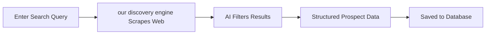

# Finding Prospects

Discover qualified leads in seconds using natural language search powered by our discovery engine AI.

---

## How It Works



**Time**: 20-40 seconds for 10-50 prospects  
**Cost**: ~€0.05 per search  
**Accuracy**: 95%+ relevant results

---

## Step-by-Step Guide

### Step 1: Open Prospect Search

Go to **Prospects** > **Find Prospects**

<Frame>
  
</Frame>

### Step 2: Enter Search Criteria

<ParamField path="query" type="string" required>
  **Search Query**
  
  Natural language description of what you're looking for.
</ParamField>

**Examples**:
- "SaaS companies in Paris"
- "Real estate agencies in Lyon with 5-20 employees"
- "French bakeries in Southern France"
- "B2B marketing agencies in Europe"
- "E-commerce stores selling fashion in USA"

<Tip>
Be specific! Include industry, location, company size, or other criteria.
</Tip>

<ParamField path="location" type="string">
  **Location** (optional)
  
  City, region, or country to filter results.
</ParamField>

**Examples**:
- "Paris, France"
- "San Francisco Bay Area"
- "United Kingdom"
- "Europe"

<ParamField path="limit" type="number" default={10}>
  **Max Results**
  
  Number of prospects to find (10-100).
</ParamField>

**Recommendations**:
- **Testing**: Start with 10 results
- **Small campaign**: 20-50 results
- **Large campaign**: 100 results (costs €0.05)

### Step 3: Click "Start Search"

our discovery engine will:
1. Understand your query using AI
2. Scrape relevant web sources
3. Extract company data
4. Return structured results

<Info>
Progress bar shows real-time status. Takes 20-40 seconds typically.
</Info>

### Step 4: Review Results

You'll see a list of prospects with:

<CardGroup cols={2}>
  <Card title="Company Name" icon="building">
    Official business name
  </Card>
  <Card title="Website" icon="globe">
    Company website URL (clickable)
  </Card>
  <Card title="Industry" icon="industry">
    Business sector/category
  </Card>
  <Card title="Location" icon="location-dot">
    City and country
  </Card>
  <Card title="Description" icon="file-lines">
    Brief summary of what they do
  </Card>
  <Card title="Enrichment Status" icon="envelope">
    Whether emails are found
  </Card>
</CardGroup>

<Frame>
  
</Frame>

### Step 5: Enrich Prospects

Click **"Enrich All"** to find email addresses for all prospects.

[Learn more about enrichment →](/sales-automation/enrichment)

---

## Search Query Best Practices

### ✅ Good Queries

<CodeGroup>
```text Example 1: Specific Industry + Location
"Software companies in Berlin"
```

```text Example 2: Industry + Size + Location
"Marketing agencies in France with 10-50 employees"
```

```text Example 3: Niche + Geography
"Organic food stores in California"
```

```text Example 4: Industry + Tech Stack
"SaaS companies using Salesforce"
```
</CodeGroup>

### ❌ Bad Queries

<CodeGroup>
```text Too Vague
"Companies"
→ Too broad, will return random results
```

```text Too Specific
"Companies selling blue widgets to Fortune 500 CEOs"
→ Too niche, might return 0 results
```

```text Wrong Format
"company_type:SaaS location:Paris"
→ Use natural language, not code syntax
```
</CodeGroup>

---

## Advanced Search Tips

### Using Filters

Combine multiple criteria in one query:

```
"B2B SaaS companies in Europe with 50-200 employees founded after 2020"
```

This searches for:
- **Industry**: B2B SaaS
- **Location**: Europe
- **Size**: 50-200 employees
- **Age**: Founded after 2020

### Industry-Specific Searches

<Tabs>
  <Tab title="B2B Tech">
    - "SaaS companies in [location]"
    - "B2B software providers"
    - "Enterprise tech companies"
    - "Cloud infrastructure startups"
  </Tab>
  
  <Tab title="E-commerce">
    - "Online retailers selling [product]"
    - "E-commerce stores in [niche]"
    - "Shopify stores in [location]"
    - "D2C brands in [industry]"
  </Tab>
  
  <Tab title="Services">
    - "Marketing agencies in [location]"
    - "Design studios"
    - "Consulting firms specializing in [field]"
    - "Real estate agencies"
  </Tab>
  
  <Tab title="Local Businesses">
    - "Restaurants in [city]"
    - "Coffee shops in [neighborhood]"
    - "Gyms and fitness centers"
    - "Hair salons in [area]"
  </Tab>
</Tabs>

### Location Targeting

<AccordionGroup>
  <Accordion title="City-Level" icon="city">
    Most precise for local businesses:
    - "Bakeries in Paris"
    - "Law firms in San Francisco"
  </Accordion>
  
  <Accordion title="Region-Level" icon="map">
    Good for regional campaigns:
    - "Wineries in Bordeaux region"
    - "Tech companies in Silicon Valley"
  </Accordion>
  
  <Accordion title="Country-Level" icon="flag">
    For national campaigns:
    - "E-commerce companies in Germany"
    - "Marketing agencies in UK"
  </Accordion>
  
  <Accordion title="Multi-Country" icon="earth-europe">
    For international outreach:
    - "SaaS startups in Europe"
    - "Software companies in North America"
  </Accordion>
</AccordionGroup>

---

## Understanding Results

### Prospect Card

Each result shows:

<Frame>
  
</Frame>

**Fields**:

| Field | Description | Example |
|-------|-------------|---------|
| **Company** | Official business name | "Acme Inc" |
| **Website** | Company URL | acme.com |
| **Industry** | Business category | "B2B SaaS" |
| **Location** | City, country | "Paris, France" |
| **Description** | What they do | "CRM for sales teams" |
| **Enrichment** | Email status | ✅ Enriched / ⚠️ Pending |

### Enrichment Status

<CardGroup cols={3}>
  <Card title="✅ Enriched" icon="circle-check">
    Emails found and verified
  </Card>
  <Card title="⚠️ Pending" icon="clock">
    Enrichment in progress
  </Card>
  <Card title="❌ Not Found" icon="circle-xmark">
    No emails found for this domain
  </Card>
</CardGroup>

---

## What To Do Next

### Option 1: Enrich Emails

Click **"Enrich All"** or select individual prospects and click **"Enrich Selected"**.

[Learn how enrichment works →](/sales-automation/enrichment)

### Option 2: Manual Review

Click on a prospect to view details:
- Full company information
- Website preview
- Contacts found (after enrichment)
- Add notes or tags

### Option 3: Export Data

Click **"Export CSV"** to download:
- Company name
- Website
- Industry
- Location
- Description

Use in other tools (CRM, spreadsheet, etc.)

### Option 4: Create Campaign

Select prospects (checkbox) and click **"Create Campaign"**.

[Learn how to create campaigns →](/sales-automation/creating-campaigns)

---

## Filtering & Sorting

### Filter Results

Use filters to narrow down:
- **Industry**: SaaS, E-commerce, Services, etc.
- **Location**: By city or country
- **Enrichment status**: Only enriched prospects
- **Tags**: Custom tags you've added

<Frame>
  
</Frame>

### Sort Results

Sort by:
- **Date added** (newest first)
- **Company name** (A-Z)
- **Enrichment score** (best emails first)

---

## Managing Prospects

### Adding Tags

Organize prospects with tags:
1. Select prospects (checkbox)
2. Click **"Add Tag"**
3. Create or select tag (e.g., "Q1 2026", "High Priority")

**Use cases**:
- Campaign tracking: "January Campaign"
- Priority: "Hot Lead", "Cold Lead"
- Industry: "SaaS", "E-commerce"
- Source: "our discovery engine", "Manual Import"

### Adding Notes

Add context for each prospect:
1. Click on prospect
2. Go to **"Notes"** tab
3. Add note (e.g., "Met at conference", "Interested in demo")

### Updating Status

Mark prospect status:
- **New**: Just added (default)
- **Contacted**: Email sent
- **Replied**: Prospect responded
- **Converted**: Deal closed

<Info>
Status updates automatically when you send campaigns and receive replies.
</Info>

---

## Troubleshooting

<AccordionGroup>
  <Accordion title="No results found">
    **Possible reasons**:
    - Query too specific (try broader search)
    - Location not recognized (try "France" instead of "Île-de-France")
    - Industry doesn't exist (try "software" instead of "SaaS blockchain")
    
    **Solutions**:
    - Remove one filter at a time
    - Try synonyms ("marketing agencies" vs "digital agencies")
    - Increase max results (10 → 50)
  </Accordion>

  <Accordion title="Results not relevant">
    **Possible reasons**:
    - Query too vague ("companies" vs "SaaS companies")
    - Mixed criteria ("restaurants and law firms")
    
    **Solutions**:
    - Be more specific
    - One industry per search
    - Use location filters
  </Accordion>

  <Accordion title="Search taking too long">
    **Normal behavior**: 20-40 seconds is typical
    
    **If > 2 minutes**:
    - Check internet connection
    - Try reducing max results (100 → 50)
    - Contact support if persists
  </Accordion>

  <Accordion title="Duplicate prospects">
    **Why it happens**: Same company appears in multiple searches
    
    **Solutions**:
    - tldr.work auto-deduplicates by domain
    - Manual: Delete duplicates from prospect list
    - Future searches won't add existing prospects
  </Accordion>
</AccordionGroup>

---

## Cost & Limits

### Pricing

| Operation | Cost |
|-----------|------|
| Prospect search (10 results) | €0.05 |
| Prospect search (50 results) | €0.05 |
| Prospect search (100 results) | €0.05 |

<Info>
Cost is **per search**, not per prospect. Finding 10 or 100 prospects costs the same!
</Info>

### Quotas

**Free plan**: €15 credits = ~300 searches  
**Starter**: €20/month budget  
**Pro**: €60/month budget  
**Ultra**: €200/month budget

---

## Next Steps

<CardGroup cols={2}>
  <Card title="Enrich Emails" icon="envelope" href="/sales-automation/enrichment">
    Find verified email addresses for your prospects
  </Card>
  <Card title="Create Campaign" icon="rocket" href="/sales-automation/creating-campaigns">
    Send personalized emails to prospects
  </Card>
  <Card title="Generate Emails with AI" icon="sparkles" href="/sales-automation/email-generation">
    Let GPT-5 write personalized outreach
  </Card>
</CardGroup>

---

<Check>
**Prospects found!** Next: [Enrich their emails →](/sales-automation/enrichment)
</Check>
