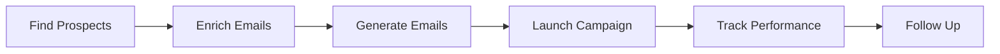

# Sales Automation

Automate your entire sales outreach process - from finding prospects to closing deals.

---

## What is Sales Automation?

Sales automation in tldr.work handles the entire outreach workflow:

<Info>
**Time saved**: What used to take 10+ hours now takes 10 minutes.
</Info>

---

## Core Features

<CardGroup cols={2}>
  <Card title="Prospect Discovery" icon="magnifying-glass" href="/sales-automation/finding-prospects">
    AI-powered search to find qualified leads matching your criteria
  </Card>
  <Card title="Email Enrichment" icon="envelope" href="/sales-automation/enrichment">
    Get verified email addresses, names, roles, and LinkedIn profiles
  </Card>
  <Card title="AI Email Generation" icon="wand-magic-sparkles" href="/sales-automation/email-generation">
    GPT-5 creates personalized emails for each prospect
  </Card>
  <Card title="Campaign Management" icon="rocket" href="/sales-automation/creating-campaigns">
    Automated sending with smart scheduling and daily limits
  </Card>
  <Card title="Performance Tracking" icon="chart-line" href="/sales-automation/tracking-analytics">
    Real-time metrics on opens, clicks, replies, and conversions
  </Card>
</CardGroup>

---

## Complete Workflow

### Step 1: Find Prospects

Search for companies matching your ideal customer profile.

**Input**: Natural language query  
**Example**: "SaaS companies in Paris with 10-50 employees"  
**Output**: List of companies with website, industry, location  
**Time**: ~30 seconds

[Learn more →](/sales-automation/finding-prospects)

### Step 2: Enrich Contacts

Get verified email addresses for decision-makers.

**Input**: Company domain  
**Process**: Searches public sources (websites, LinkedIn, directories)  
**Output**: Name, role, email, verification score  
**Time**: ~2 seconds per prospect

[Learn more →](/sales-automation/enrichment)

### Step 3: Generate Personalized Emails

AI writes unique emails for each prospect.

**Input**: Campaign goal, tone, length  
**Process**: GPT-5 analyzes prospect data and creates contextual email  
**Output**: Subject line + email body  
**Time**: ~3 seconds per email

[Learn more →](/sales-automation/email-generation)

### Step 4: Launch Campaign

Send emails automatically with smart scheduling.

**Input**: Selected prospects, email template  
**Process**: Queue emails with daily limits, track opens/clicks  
**Output**: Campaign dashboard with real-time stats  
**Time**: Continuous (50 emails/day default)

[Learn more →](/sales-automation/creating-campaigns)

### Step 5: Track & Optimize

Monitor performance and improve results.

**Metrics**: Opens, clicks, replies, bounces, conversions  
**Insights**: Best-performing emails, optimal send times  
**Actions**: A/B test subjects, refine targeting  

[Learn more →](/sales-automation/tracking-analytics)

---

## Who Should Use Sales Automation?

<Tabs>
  <Tab title="B2B Sales Teams">
    **Use case**: Generate qualified leads for CRM/SaaS products
    
    **Workflow**:
    1. Search: "B2B companies with 50-200 employees"
    2. Enrich: Find CTOs and sales managers
    3. Personalize: Mention company industry and pain points
    4. Send: 50 emails/day per rep
    
    **Results**: 10x more outreach, 3x higher response rate
  </Tab>
  
  <Tab title="Agencies">
    **Use case**: Acquire local businesses as clients
    
    **Workflow**:
    1. Search: "Restaurants in Lyon without websites"
    2. Enrich: Find owner/manager contacts
    3. Personalize: Mention location and competitors
    4. Send: Hyper-local campaigns
    
    **Results**: 45% open rate, 8% response rate
  </Tab>
  
  <Tab title="Founders">
    **Use case**: Find first customers for startup
    
    **Workflow**:
    1. Search: "Funded startups in tech, 5-20 employees"
    2. Enrich: Target founders and early employees
    3. Personalize: Reference funding round, team size
    4. Send: Personal, founder-to-founder outreach
    
    **Results**: 5 paying customers in first month
  </Tab>
  
  <Tab title="Recruiters">
    **Use case**: Source candidates for open roles
    
    **Workflow**:
    1. Search: "Software engineers at Y Combinator companies"
    2. Enrich: Get LinkedIn profiles and emails
    3. Personalize: Mention their company and experience
    4. Send: Warm, opportunity-focused outreach
    
    **Results**: 20% response rate for passive candidates
  </Tab>
</Tabs>

---

## Key Benefits

### ⚡ Speed

| Task | Manual | With tldr.work |
|------|--------|----------------|
| Find 50 prospects | 2 hours | 30 seconds |
| Enrich 50 emails | 3 hours | 2 minutes |
| Write 50 personalized emails | 4 hours | 30 seconds |
| Send & track campaign | 2 hours | 1 minute |
| **TOTAL** | **11 hours** | **4 minutes** |

### 🎯 Quality

- **95%+ accurate** prospect data (powered by our discovery engine)
- **98%+ deliverable** emails (our enrichment engine verification)
- **Human-quality** personalization (GPT-5)
- **Low bounce rate** (<5% typically)

### 💰 Cost-Effectiveness

**Example**: 500 prospects/month
- **Manual**: $2,000 (20 hours × $100/hr)
- **VA/freelancer**: $500 (low quality, slow)
- **tldr.work**: $30-50/month

**ROI**: 20-40x vs manual, 10x vs VA

### 📊 Measurability

Track everything:
- Opens, clicks, replies
- Best-performing emails
- Conversion rate by industry/location
- ROI per campaign

---

## Best Practices

<AccordionGroup>
  <Accordion title="1. Define Your ICP (Ideal Customer Profile)" icon="bullseye">
    Before searching, know:
    - **Industry**: SaaS, e-commerce, healthcare, etc.
    - **Company size**: Employees, revenue range
    - **Location**: Geography matters (timezone, language, regulations)
    - **Tech stack**: What tools do they use?
    - **Pain points**: What problems can you solve?
    
    **Good query**: "B2B SaaS companies in Europe, 50-200 employees, using Salesforce"  
    **Bad query**: "Companies that might need marketing help"
  </Accordion>

  <Accordion title="2. Verify Before Sending" icon="circle-check">
    Always check:
    - Email verification score (>90 recommended)
    - Company website is active
    - Contact role matches your target (don't email interns for CEO-level deals)
    - No duplicate contacts (same person at different companies)
  </Accordion>

  <Accordion title="3. Personalize Beyond Name" icon="user">
    AI personalizes based on:
    - Company industry and size
    - Recipient role and seniority
    - Location and market
    - Recent news or funding
    
    **Example**: "Saw Acme just raised $10M - congrats! As you scale from 20 to 100 people, outbound sales will get harder. We help Series A companies automate prospecting..."
  </Accordion>

  <Accordion title="4. Test and Iterate" icon="flask">
    A/B test:
    - Subject lines (short vs long, question vs statement)
    - Email length (50 words vs 200 words)
    - Tone (professional vs casual)
    - CTA (meeting request vs demo offer vs free trial)
    
    **Track**: Which variant gets more opens? Clicks? Replies?
  </Accordion>

  <Accordion title="5. Follow Up (But Don't Spam)" icon="reply">
    Best practices:
    - **1st follow-up**: After 3 days (if no reply)
    - **2nd follow-up**: After 1 week (if still no reply)
    - **Stop after 3 emails**: Don't be annoying
    - **Add value**: Each follow-up should offer something new (case study, blog post, discount)
  </Accordion>
</AccordionGroup>

---

## Common Mistakes to Avoid

<Warning>
**Don't send 500 emails on day 1**  
Gradual warm-up prevents spam filters. Start with 20-30/day, increase by 10-20% weekly.
</Warning>

<Warning>
**Don't use generic templates**  
"Hi [Name], I hope this email finds you well..." = instant delete. Be specific and relevant.
</Warning>

<Warning>
**Don't ignore bounce rate**  
>5% bounce rate = your domain reputation drops. Clean your list regularly.
</Warning>

<Warning>
**Don't buy email lists**  
Purchased lists have terrible deliverability and damage your sender reputation. Always build your own.
</Warning>

---

## Success Metrics

### Good Benchmarks

| Metric | Good | Great | Excellent |
|--------|------|-------|-----------|
| **Open Rate** | 30-40% | 40-50% | >50% |
| **Click Rate** | 2-5% | 5-10% | >10% |
| **Reply Rate** | 3-5% | 5-8% | >8% |
| **Conversion Rate** | 0.5-1% | 1-2% | >2% |
| **Bounce Rate** | <5% | <3% | <1% |

<Tip>
If your metrics are below "Good", check:
- Email personalization quality
- Target audience relevance
- Subject line effectiveness
- Sender reputation (domain warmth)
</Tip>

---

## Next Steps

Ready to automate your sales? Follow the guides:

<Steps>
  <Step title="Find Prospects" href="/sales-automation/finding-prospects">
    Search for qualified leads matching your ICP
  </Step>
  <Step title="Enrich Emails" href="/sales-automation/enrichment">
    Get verified email addresses for each prospect
  </Step>
  <Step title="Generate Emails" href="/sales-automation/email-generation">
    Use AI to create personalized outreach
  </Step>
  <Step title="Create Campaign" href="/sales-automation/creating-campaigns">
    Set up and launch your automated campaign
  </Step>
  <Step title="Track Performance" href="/sales-automation/tracking-analytics">
    Monitor results and optimize for better conversion
  </Step>
</Steps>

---

<Check>
**Ready to scale your outreach?** Start with [Finding Prospects →](/sales-automation/finding-prospects)
</Check>
