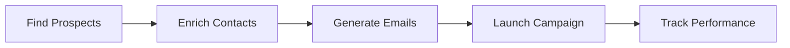

# Sales Automation

Automate your outreach workflow from prospect discovery to campaign performance tracking.

---

## Why Use Sales Automation?

Manual outreach is slow and hard to scale.

With tldr.work, your team can:
- Find qualified prospects faster
- Get verified contact data
- Generate personalized emails
- Launch campaigns with clear limits
- Track opens, clicks, and replies

---

## How It Works

**Time**: 5-15 minutes to set up your first campaign  
**Goal**: Build a repeatable outreach process  
**Output**: More replies with less manual work

---

## Quick Start

<Steps>
  <Step title="Find Prospects">
    Search for companies that match your ICP
  </Step>
  <Step title="Enrich Contacts">
    Get verified emails and role data
  </Step>
  <Step title="Generate Emails">
    Create personalized outreach with AI
  </Step>
  <Step title="Create Campaign">
    Choose contacts, content, and send settings
  </Step>
  <Step title="Track Results">
    Monitor campaign performance and improve
  </Step>
</Steps>

---

## Core Features

<CardGroup cols={2}>
  <Card title="Prospect Discovery" icon="magnifying-glass" href="/sales-automation/finding-prospects">
    Find relevant companies with natural-language search
  </Card>
  <Card title="Email Enrichment" icon="envelope" href="/sales-automation/enrichment">
    Get contact details and email verification
  </Card>
  <Card title="AI Email Generation" icon="wand-magic-sparkles" href="/sales-automation/email-generation">
    Generate personalized outreach at scale
  </Card>
  <Card title="Campaign Creation" icon="rocket" href="/sales-automation/creating-campaigns">
    Launch structured campaigns with sending controls
  </Card>
  <Card title="Tracking and Analytics" icon="chart-line" href="/sales-automation/tracking-analytics">
    Measure opens, clicks, replies, and outcomes
  </Card>
</CardGroup>

---

## Key Metrics

- Open rate
- Click rate
- Reply rate
- Bounce rate
- Conversion rate

---

## Next Steps

<Steps>
  <Step title="Find Prospects" href="/sales-automation/finding-prospects">
    Start with your target market search
  </Step>
  <Step title="Enrich Contacts" href="/sales-automation/enrichment">
    Add verified contact data
  </Step>
  <Step title="Generate Emails" href="/sales-automation/email-generation">
    Produce personalized messages
  </Step>
  <Step title="Create Campaign" href="/sales-automation/creating-campaigns">
    Configure and launch your outreach
  </Step>
  <Step title="Track Performance" href="/sales-automation/tracking-analytics">
    Optimize based on real results
  </Step>
</Steps>

---

<Check>
**Ready to launch?** Start with [Finding Prospects ->](/sales-automation/finding-prospects)
</Check>
